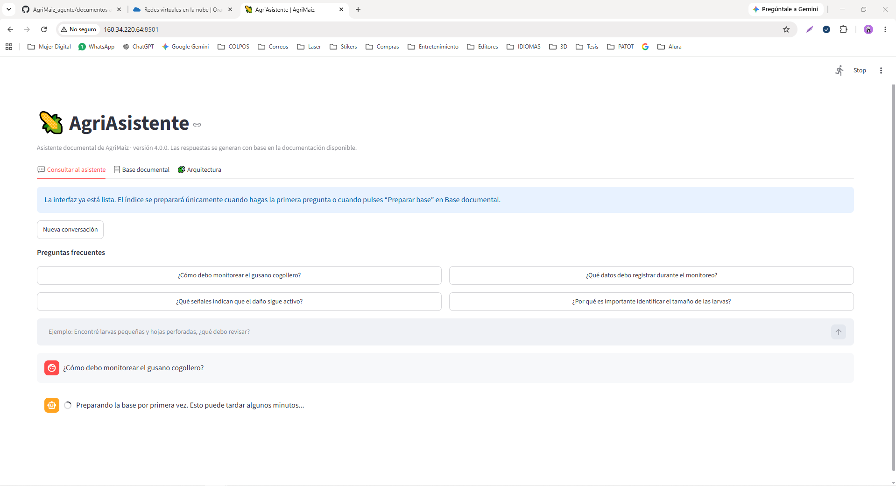
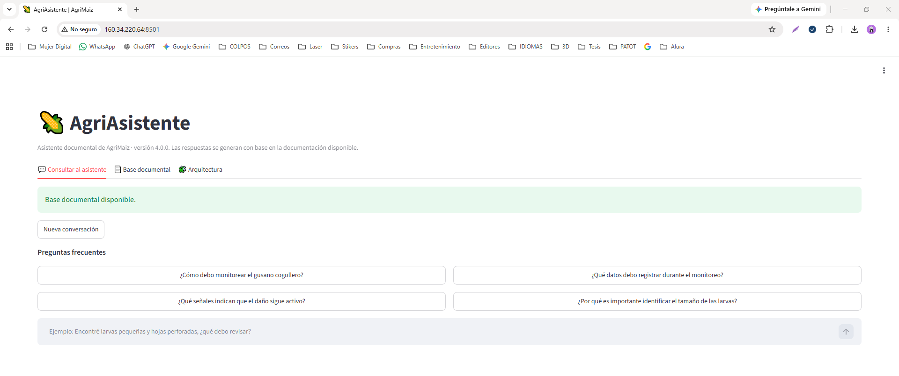
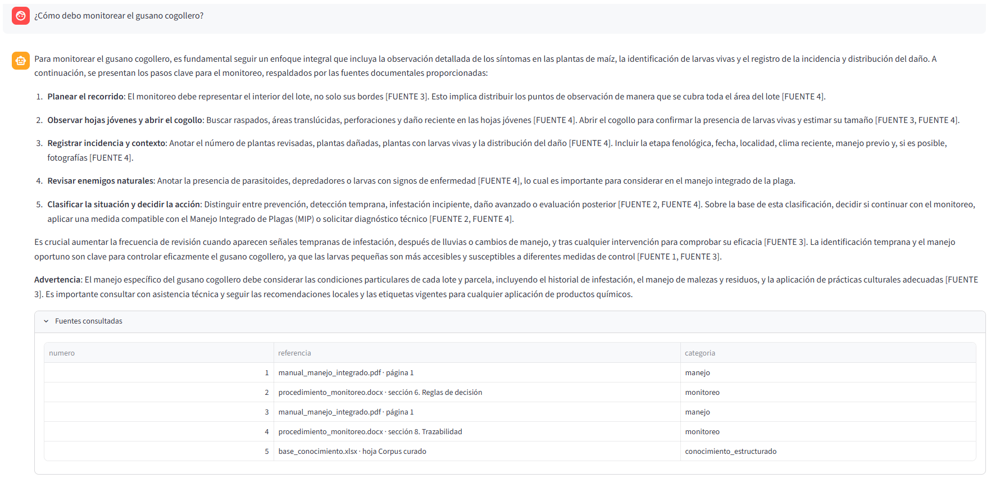
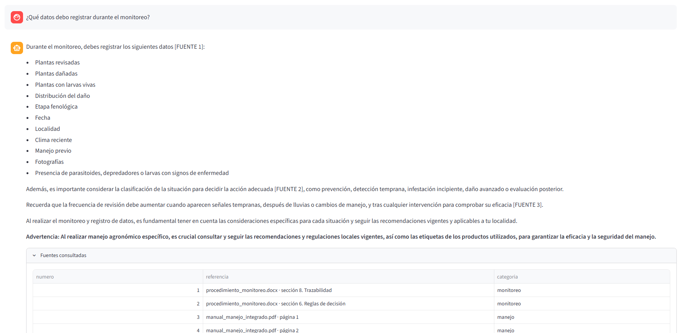
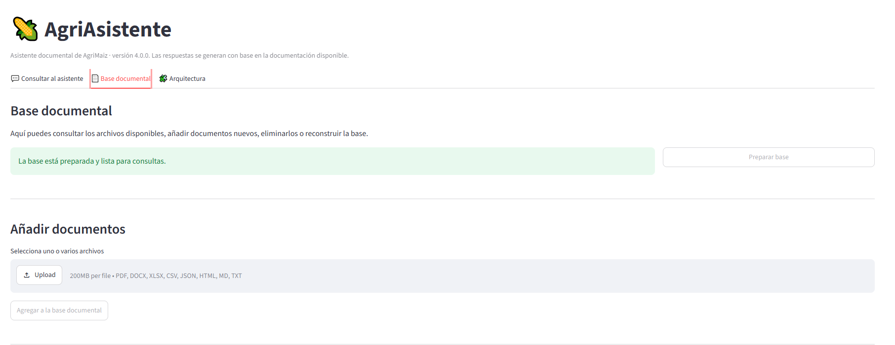
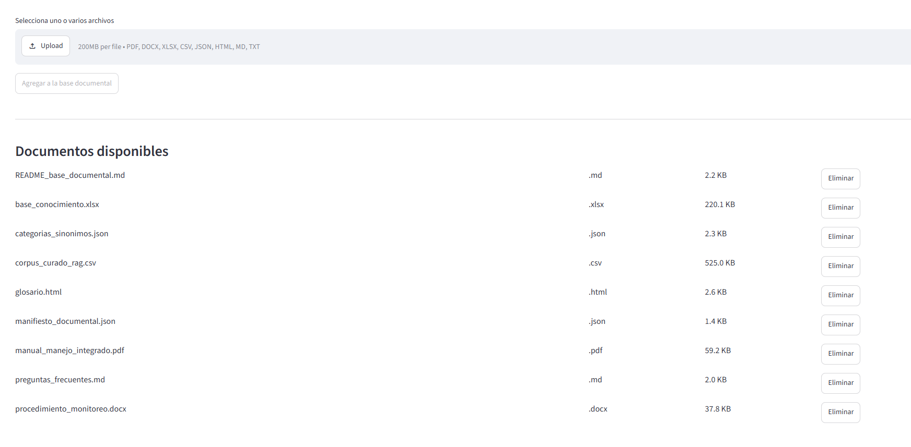
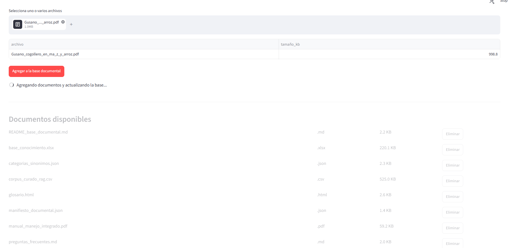
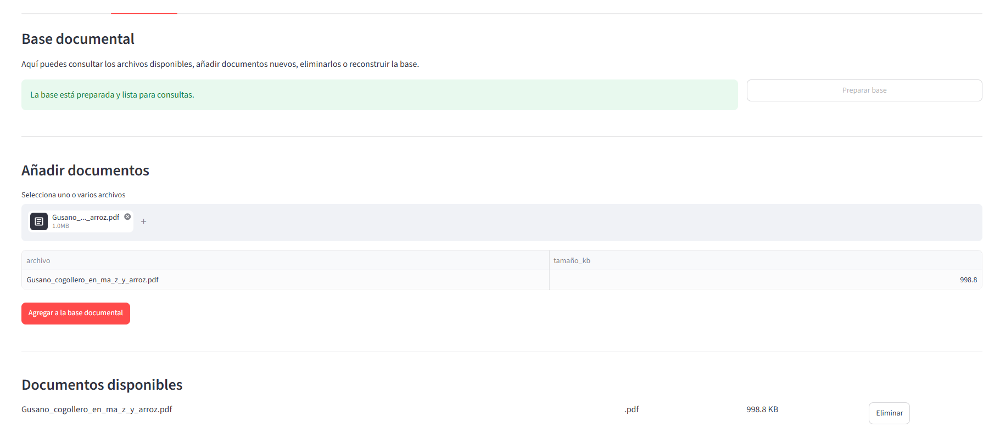
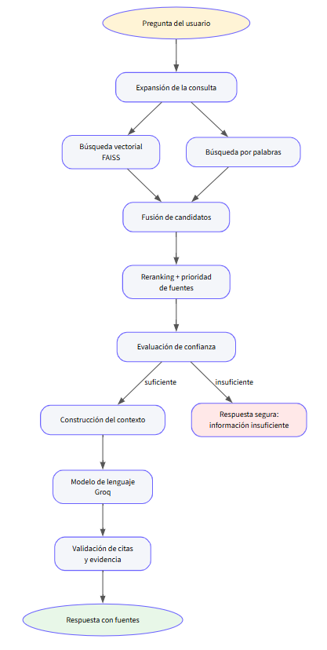
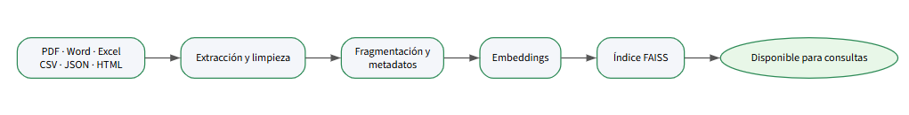

# 🌽 AgriAsistente

> Asistente inteligente basado en Retrieval-Augmented Generation (RAG) para consultar documentación técnica sobre el manejo integrado de *Spodoptera frugiperda* (gusano cogollero) en el cultivo de maíz.

---

# Descripción

AgriAsistente es una aplicación desarrollada como parte del desafío **Agentes Inteligentes** de Alura.

El sistema utiliza una arquitectura **Retrieval-Augmented Generation (RAG)** para recuperar información desde una base documental previamente indexada y generar respuestas fundamentadas mediante un modelo de lenguaje.

La aplicación permite consultar manuales, procedimientos, preguntas frecuentes y documentos técnicos, mostrando siempre las fuentes utilizadas para construir la respuesta.

---

# Características

- Consulta mediante lenguaje natural.
- Arquitectura Retrieval-Augmented Generation (RAG).
- Recuperación híbrida de documentos.
- Re-ranking de resultados.
- Base documental editable desde la interfaz.
- Actualización automática del índice.
- Respuestas con referencias a las fuentes.
- Arquitectura visual integrada.
- Despliegue en Oracle Cloud Infrastructure (OCI).
- Contenedorización mediante Podman.

---

# Arquitectura

El flujo del sistema es el siguiente:

```
Pregunta del usuario
        │
        ▼
Recuperación híbrida
        │
        ▼
Re-ranking
        │
        ▼
Construcción del contexto
        │
        ▼
LLM (Groq)
        │
        ▼
Respuesta con fuentes
```

---

# Tecnologías utilizadas

- Python 3.11
- Streamlit
- LangChain
- FAISS
- Sentence Transformers
- Groq API
- Oracle Cloud Infrastructure
- Podman
- Git

---

# Estructura del proyecto

```
AgriMaiz_agente/
│
├── app.py
├── agente.py
├── documentos/
├── almacenamiento/
├── requirements.txt
├── Dockerfile
├── .env.example
├── README.md
└── registros/
```

---

# Instalación

Clonar el repositorio

```bash
git clone https://github.com/PatriciaTovar/AgriMaiz_agente.git
```

Entrar al proyecto

```bash
cd AgriMaiz_agente
```

Crear entorno virtual

```bash
python -m venv .venv
```

Activar el entorno

Windows

```powershell
.\.venv\Scripts\Activate.ps1
```

Linux

```bash
source .venv/bin/activate
```

Instalar dependencias

```bash
pip install -r requirements.txt
```

---

# Variables de entorno

Crear un archivo `.env`

```env
GROQ_API_KEY=TU_API_KEY
GROQ_MODEL=llama-3.3-70b-versatile
```

---

# Ejecución

Ejecutar la aplicación

```bash
streamlit run app.py
```

La primera ejecución puede tardar algunos minutos mientras se genera el índice documental.

Posteriormente las consultas se realizan utilizando el índice previamente construido.

---

# Despliegue en Oracle Cloud Infrastructure

**http://160.34.220.64:8501**

La aplicación fue desplegada en una instancia **Oracle Cloud Infrastructure Compute** utilizando:

- Oracle Linux 8
- Podman
- Streamlit
- Puerto 8501
- Almacenamiento persistente mediante volúmenes
- Variables de entorno para la configuración del modelo

Para ejecutar el contenedor:

```bash
podman run -d \
  --name agrimaiz-asistente \
  --restart=always \
  -p 8501:8501 \
  --env-file .env \
  -v ~/agrimaiz-datos/documentos:/app/documentos:Z \
  -v ~/agrimaiz-datos/almacenamiento:/app/almacenamiento:Z \
  agrimaiz-asistente
```

Se configuró la Security List de OCI para permitir tráfico TCP por el puerto **8501**, haciendo accesible la aplicación desde Internet.

---

# Registro de ejecución

Las pruebas del sistema se realizaron directamente sobre la instancia desplegada en Oracle Cloud Infrastructure.

Durante la validación se comprobó:

- Construcción correcta de la imagen.
- Inicio del contenedor mediante Podman.
- Configuración de almacenamiento persistente.
- Disponibilidad del servicio HTTP.
- Respuesta correcta del endpoint de salud (`/_stcore/health`).
- Acceso mediante dirección IP pública.
- Preparación automática de la base documental.
- Consultas exitosas utilizando la arquitectura RAG.

Ejemplo de registro:

```json
{
  "timestamp":"2026-07-24T22:45:18",
  "pregunta":"¿Cómo debo monitorear el gusano cogollero?",
  "documentos_recuperados":4,
  "latencia_ms":1812,
  "estado":"OK"
}
```

---

# Resultados

Durante las pruebas de funcionamiento se verificó correctamente:

| Funcionalidad | Estado |
|--------------|:------:|
| Despliegue en OCI | ✅ |
| Construcción del índice | ✅ |
| Recuperación de documentos | ✅ |
| Generación de respuestas | ✅ |
| Visualización de fuentes | ✅ |
| Interfaz Streamlit | ✅ |
| Acceso mediante IP pública | ✅ |

---

# Evidencias
## Despliegue en OCI
La aplicación fue desplegada exitosamente en Oracle Cloud Infrastructure utilizando Oracle Linux 8, Podman y Streamlit, quedando accesible mediante una dirección IP pública.



## Interfaz principal
Vista inicial de AgriAsistente una vez desplegado.



## Consulta realizada
Ejemplo de una consulta realizada por el usuario.



Respuesta generada por el asistente utilizando la base documental.




## Base documental

Preparación inicial de la base documental.



Proceso de preparación del índice.



Documentos cargados para la indexación.



Reconstrucción automática del índice RAG.



## Arquitectura
Arquitectura del sistema

Arquitectura general del proceso Retrieval-Augmented Generation (RAG).



Flujo de actualización de la base documental.



# Trabajo futuro

Como mejoras futuras se plantea:

- Registro automático de consultas.
- Dashboard de métricas.
- Monitoreo y observabilidad.
- Integración con nuevos modelos de lenguaje.

---

# Autora

**Patricia Guadalupe Tovar De La Torre**

---

## Licencia

Proyecto desarrollado con fines académicos como parte del desafío **Agente** de Alura.
